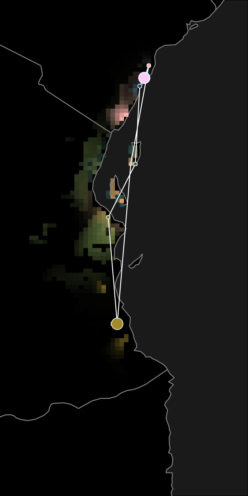
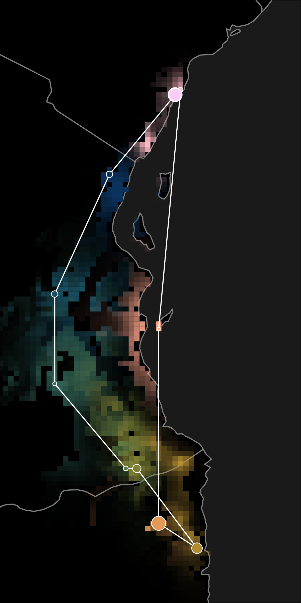
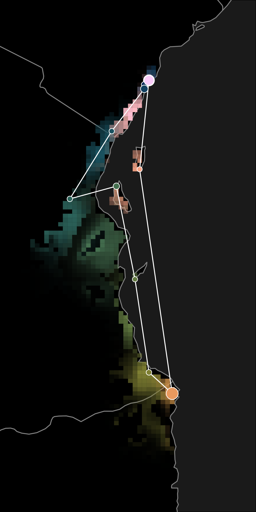
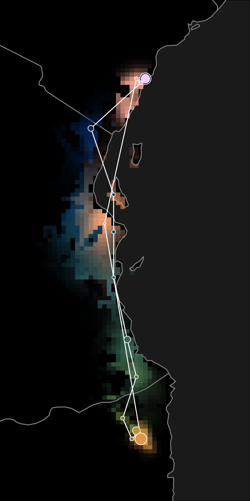
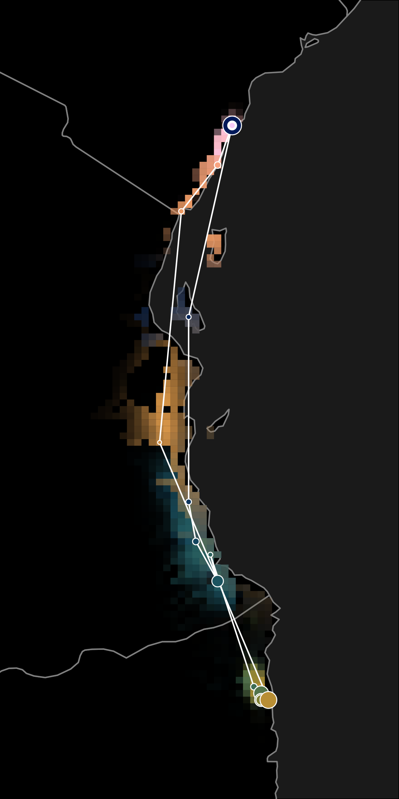
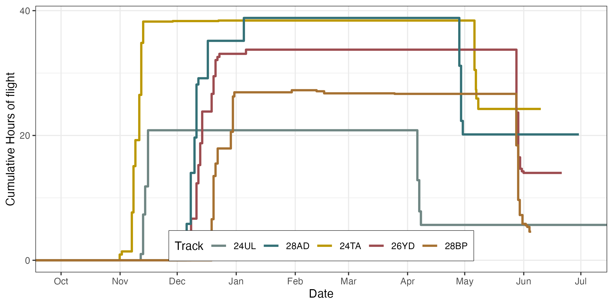

## Introduction

```{r, results = "asis", echo = FALSE}
d <- read_excel("../data/gpr_settings.xlsx") %>%
  filter(keep)

d %>%
  dplyr::select(gdl_id, common_name, ringNo, crop_start, crop_end) %>%
  kable() %>%
  column_spec(seq(1, 5), background = d$Color)
```


## Trajectories

In order: 24UL ; 28AD ; 24TA ; 26YD ; 28BP


{style="width:30%;"} {style="width:30%;"} {style="width:30%;"} {style="width:30%;"} {style="width:30%;"}

## Breeding location - 99% uncertainty range

MK are the two light blue colored while RCRC are warmer red-yellow colored.

All our bird seems to be breeding near the border between Tanzania and Mozambique

{style="width:100%;"}

## Cumulative flight duration

Taking a step back and first looking at the total flight duration in both migratory season, we can see how all birds were flying much longer in pre-breeding season (Nov-Dec) than on their way back after breeding (Apr-Jun). The determination of these flight duration is relatively accurate, coming from accelerator data.

Two options: the birds are taking a detour in pre-breeding season (but why?), or they are facing different wind regime that strongly affect their migratory duration/timing. 

{style="width:100%;"}


```{r, results = "asis", echo = FALSE}
# List all the html file found on in the reports/html folder
f <- list.files(path = ".", patter = "*.html", recursive = TRUE)

f_dirname <- lapply(f, dirname)
f_basename <- lapply(f, basename)

for (i_f_dir in unique(f_dirname)) {
  cat(paste("## ", tools::toTitleCase(stringr::str_replace_all(i_f_dir, "_", " "))))
  cat("\n")
  for (i_f in seq_len(length(f))) {
    if (f_dirname[[i_f]] == i_f_dir) {
      cat(paste("* <a href='", f[[i_f]], "'>", sub("\\.html$", "", f_basename[[i_f]]), "</a>"), sep = "\n")
    }
  }
  cat("\n")
}
```
